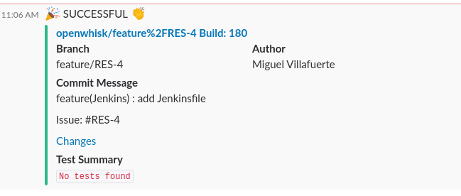

<p align="center"></p>
<h1 align="center">Jenkins Shared Libraries Scala</h1>
<p align="center">
  <a href="https://github.com/scala/scala/releases">
    
  </a>  
  <a href="https://www.oracle.com/technetwork/java/javase/11all-relnotes-5013287.html">
    
  </a>
  <a href="https://github.com/mvillafuertem/scala/actions?query=workflow%3A%22scalaci%22">
    
  </a>
</p> 

****

The Project "jenkins-shared-libraries-scala" offers unit test pipelines with scala test.

****

## Simple Pipeline

```groovy
library 'jenkins-shared-libraries-scala'

pipeline {
    agent any

    stages {
        stage('Hello') {
            steps {
                echo 'Hello World'
            }
        }
        stage('SayHello') {
            steps {
                sayHello('Pepe')
            }
        }
        stage('AwsWorkflow') {
            steps {
                awsWorkflow() // throw CpsCompilationErrorsException: unable to resolve class io.github.io.github.mvillafuertem.aws.AwsWorkflow
            }
        }
    }
}
```

## slackSendNotification


